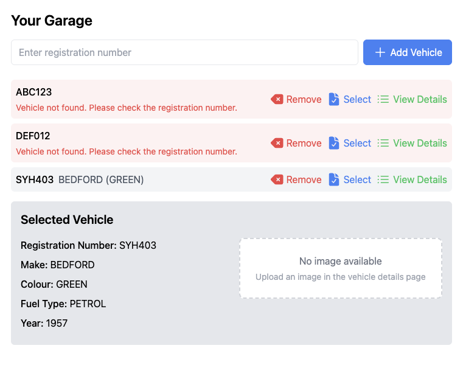

# DVLA Vehicle Lookup

## Requirements:
- For every car registration plate stored in the system, fetch and display as much information as possible from the DVLA API.
- At a minimum, show the make, model, year, and an image of the vehicle.
- Ensure the UI:
-- Displays all saved cars.
-- Allows users to add new cars, delete saved cars, and view more details for each one.
-- Handles and displays errors gracefully if the DVLA API integration fails.
-- Is styled neatly.
-- (Bonus) Is mobile-friendly/responsive.

## Constraints:
- Only valid and verified registration plates should be stored in the saved list.
- The codebase contains bugs and incomplete sections — these must be identified and fixed.

## Features:
- Vehicle registration directory interface with controls to add new entries, select existing items to reveal attached image and brief details.
- API service module with error response handling.
- Validation of vehicle registrations in directory on session start, and upon adding a new entry.
- Vehicle information page with controls to return to and remove from directory, add and remove an attached image.
- Vehicle information, validation conditions, and attached image cached in local storage for duration of user session, limiting excessive API requests.
- (Bonus) mobile-friendly/responsive.

## Dependencies and Installation
- Install dependencies with `npm i`
- Launch server with `npm run dev`
